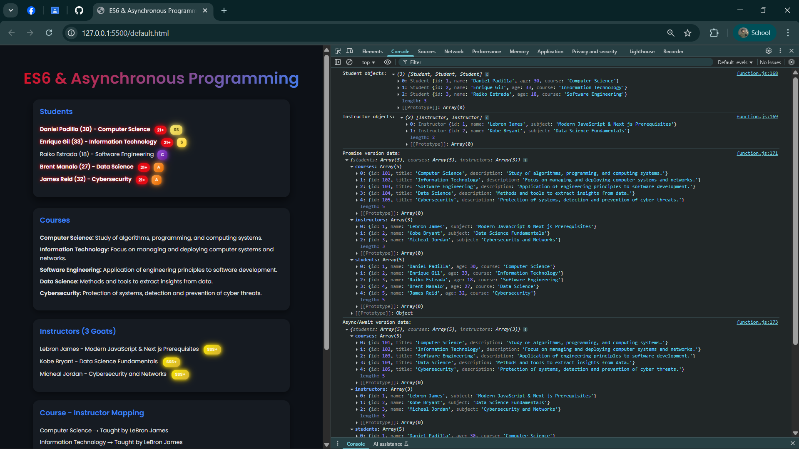
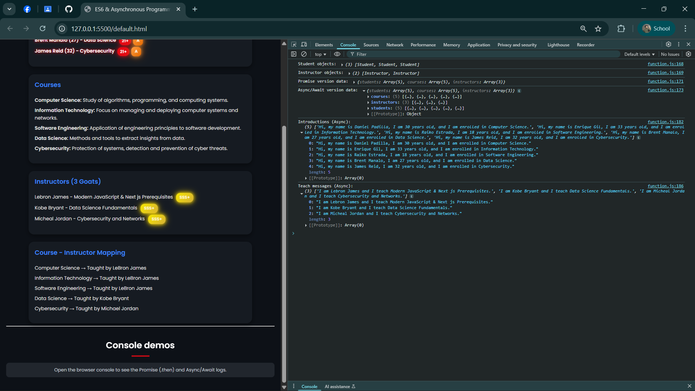

# 📝 IT Elective 1 – Advanced Web Development  

| **Activity** | **Instructor** | **Semester** | **Schedule** |
|----------------|-------------------|---------------|--------------|
| ES6 & Asynchronous Programming | John Rey Silverio | 1st Sem. AY 2025–2026 | Saturday, 8:00 AM – 12:00 PM |

---

# Project Overview

This project is an **academic activity** for IT Elective 1 (Advanced Web Development).  
It demonstrates the use of **ES6 features** (classes, template literals, maps, arrow functions) and **Asynchronous Programming** (Promises + Async/Await) in a web-based application.

---

## Features

- **Course List** – Displays all courses with titles and descriptions.  
- **Instructor Section** – Shows instructors with glowing **SSS+ badges**.  
- **Student Section** – Lists students with:
  - **Rank badges** (SS, S, A, C, etc.)  
  - **21+ badge** for students aged 21 and above  
  - **Bold + glow effect** highlighting adult students  
- **Async Data Fetching** – Data is loaded from a local JSON file (`data/students.json`) using:
  - **Promise-based fetch**
  - **Async/Await fetch**
- **Modern ES6+ Syntax** – Uses classes (`Student`, `Instructor`), `map()`, template literals, and modular structure.

---

## 🖼️ Preview Screenshot  

  
  

---

## 🗂️ Project Structure
📂 project-root  
┣ 📜 index.html # Main HTML file  
┣ 📜 styles.css # CSS (badges, glowing effects, layout)  
┣ 📜 script.js # JS logic (ES6 classes + async rendering)  
┣ 📂 data  
┃ ┗ 📜 students.json # JSON data source  
┣ 📜 screenshot.png # Output preview image  
┗ 📜 README.md # Documentation

---

## 🚀 How to Run

1. Clone or download this repository.  
2. Ensure `data/students.json` is inside a `data` folder.  
3. Open `index.html` in your browser.  
4. Open the browser console (`F12`) to see:
   - Student `introduce()` messages
   - Instructor `teach()` messages
   - Promise vs. Async/Await logs  

---
